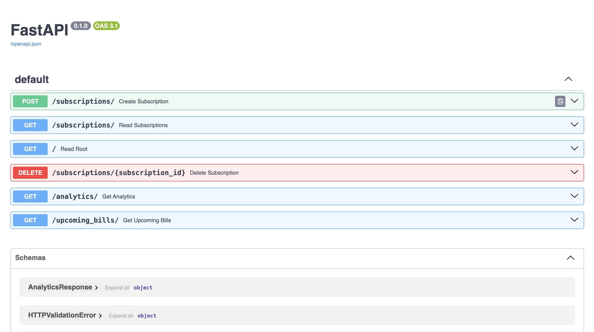

# Smart Subscription Tracker API



A high-performance RESTful API (built with FastAPI) designed for tracking recurring expenses and automatically displaying upcoming bills

## Overview
This Backend API solves the ongoing issue of users being unaware of recurring bills by using **smart date logic** to calculate renewal windows and alert users of upcoming bills within the next 7 days.

This Application was built with a clear focus on **data integrity** (using Pydantic validation) and **scalability** (using Router-Controller pattern).

## Tech Stack
* **Language:** Python 3.10+
* **Framework:** FastAPI - Swagger UI
* **Database:** SQLite (SQLAlchemy ORM)
* **Validation:** Pydantic
* **Server:** Uvicorn

## Key Features
* **CRUD Operations:** Able to create, read and delete subscriptions for full lifecycle management.
* **Smart Forecasting:** Automatically calculates date deltas to display upcoming bills within a rolling 7-day window only.
* **Strict Validation:** Prevents bad data entries and data corruption by enforcing strict type checks (i.e., rejecting string inputs for price fields) via Pydantic schemas
* **Modular Architecture:** Seperation of files between Models (DB), Schemas (Validation), and Routers (Endpoints)

## API Endpoints
| Method | Endpoint | Description |
| :--- | :--- | :--- |
| `POST` | `/subscriptions/` | Creates a new subscription with type validation. |
| `GET` | `/subscriptions/` | Reads all active subscriptions. |
| `GET` | `/` | Checks the status of the Subscription Tracker
| `DELETE` | `/subscriptions/{subscription_id}` | Removes a subscription from the database. |
| `GET`| `/analytics/` | Retrieves the monthly and yearly price totals based on prices of individual subscriptions
| `GET` | `/upcoming_bills/` | Uses **Smart Forecasting** to return bills due in the next 7 days. |


## How to Run the code locally

### 1. Clone the Repository

```bash
git clone https://github.com/hamdidris789/subscription-tracker.git
cd subscription-tracker
```

### 2. Create Virual Environment

```
# Mac/Linux

python3 -m venv venv
source venv/bin/activate

# Windows
python -m venv venv
.\venv\Scripts\activate
```

### 3. Install Dependencies

```
pip install -r requirements.txt
```

### Run the Server

```
uvicorn app.main:app --reload
```

After running the server. The FastAPI - Swagger UI will be live and available to view using this link: http://127.0.0.1:8000/docs#/

## Documentation
Interactive API documentation (Swagger UI) is available at: http://127.0.0.1:8000/docs

---
*Built by Hamdi Idris as a specialized Backend Engineering project.*
